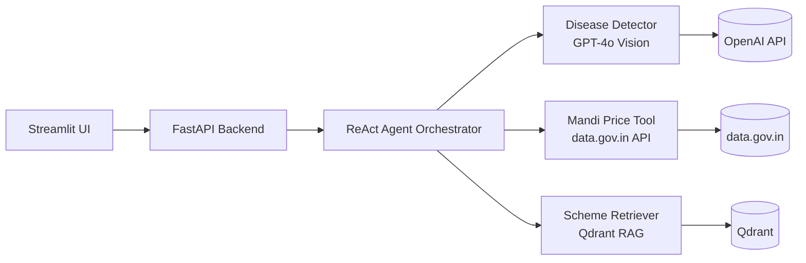

<div align="center">

# Project Kisan

**AI-powered agricultural assistant for Indian farmers**

[](https://www.python.org/downloads/)
[](https://fastapi.tiangolo.com/)
[](https://openai.com/)
[](https://qdrant.tech/)
[](LICENSE)

</div>

Bilingual AI chatbot helping Indian farmers with disease detection, mandi prices, and government schemes. Supports English, Hindi, and Hinglish through a conversational interface powered by a ReAct agent.

## Features

| Disease Detection | Mandi Prices | Government Schemes |
|:-:|:-:|:-:|
| Upload a crop photo and get diagnosis with treatment recommendations | Ask for real-time market prices by commodity and location | Ask about eligibility, benefits, and application steps for agricultural schemes |
| Powered by GPT-4o vision | Powered by data.gov.in API | Powered by RAG over scheme PDFs with Qdrant |

## Architecture



## Quick Start

### Prerequisites

- [Python 3.11+](https://www.python.org/downloads/)
- [uv](https://docs.astral.sh/uv/getting-started/installation/) package manager (`curl -LsSf https://astral.sh/uv/install.sh | sh`)
- [Docker](https://docs.docker.com/get-started/get-docker/) (for running Qdrant locally)
- [OpenAI API key](https://platform.openai.com/api-keys) (requires an OpenAI account)

### 1. Install dependencies

```bash
git clone https://github.com/thedatamonk/farmer-buddy.git
cd farmer-buddy
uv sync
```

### 2. Configure environment

```bash
cp .env.example .env
# Edit .env and set:
#   OPENAI_API_KEY=sk-...
#   MANDI_API_KEY=...       (optional, for live mandi prices)
```

### 3. Start Qdrant

```bash
docker run -d -p 6333:6333 qdrant/qdrant
```

### 4. Index government scheme documents

```bash
# Place PDF files in data/schemes/, then:
uv run python scripts/index_schemes.py
```

> **Note:** Scheme PDFs are not included in the repository. You must supply your own PDF documents in `data/schemes/` before indexing.

### 5. Run the API server

```bash
uv run uvicorn kisan.api.main:app --reload --port 8080
```

### 6. Launch the Streamlit UI

From a new terminal window

```bash
uv run streamlit run ui/app.py
```

## API Reference

| Method | Endpoint | Description |
|--------|----------|-------------|
| `GET` | `/health` | Health check |
| `POST` | `/api/v1/chat` | Send a message (text and/or image) |
| `GET` | `/api/v1/sessions/{session_id}` | Get conversation history |
| `DELETE` | `/api/v1/sessions/{session_id}` | Delete a session |

Interactive docs available at [http://localhost:8080/docs](http://localhost:8080/docs) when the server is running.

## Project Structure

```
src/kisan/
├── agent/                  # ReAct agent orchestrator
│   ├── orchestrator.py     #   Agent loop & tool dispatch
│   ├── prompts.py          #   System prompts
│   ├── memory.py           #   Conversation memory
│   └── tools.py            #   Tool definitions
├── api/                    # FastAPI application
│   ├── main.py             #   App entrypoint & lifespan
│   ├── dependencies.py     #   Dependency injection
│   └── routes/             #   Route handlers (chat, health)
├── core/                   # Shared configuration
│   ├── config.py           #   Settings (pydantic-settings)
│   ├── exceptions.py       #   Custom exceptions
│   └── logging.py          #   Loguru setup
├── modules/                # Feature modules
│   ├── disease/            #   GPT-4o vision disease detector
│   ├── mandi/              #   Mandi price client, parser, scheduler
│   └── schemes/            #   Scheme RAG (embeddings, indexer, retriever)
├── schemas/                # Pydantic models (chat, disease, mandi, scheme)
├── services/               # Infrastructure services (LLM, session, vectordb, database)
└── utils/                  # Utilities (PDF processing)
```

## Deployment

<details>
<summary><strong>Docker</strong></summary>

Build and run the API container:

```bash
docker build -t kisan-api .
docker run -p 8080:8080 \
  -e OPENAI_API_KEY=sk-... \
  -e QDRANT_URL=http://host.docker.internal:6333 \
  kisan-api
```

Build and run the UI container:

```bash
docker build -f Dockerfile.ui -t kisan-ui .
docker run -p 8501:8501 \
  -e API_URL=http://host.docker.internal:8080/api/v1 \
  kisan-ui
```

</details>

<details>
<summary><strong>Render</strong></summary>

#### 1. Set up Qdrant Cloud

Create a free cluster at [Qdrant Cloud](https://cloud.qdrant.io/):

1. Sign up / log in at [cloud.qdrant.io](https://cloud.qdrant.io/)
2. Create a new **Free Tier** cluster (choose the region closest to your Render services)
3. Note your **Cluster URL** (e.g. `https://abc-123.us-east4-0.gcp.cloud.qdrant.io`)
4. Generate an **API key** from the cluster dashboard

You'll use these values for `QDRANT_URL` and `QDRANT_API_KEY` in the steps below.

#### 2. Deploy on Render

The project includes a `render.yaml` Blueprint for one-click deployment.

| Service | Type | Plan |
|---------|------|------|
| `kisan-api` | Web Service (Docker) | Free |
| `kisan-ui` | Web Service (Docker) | Free |
| `kisan-db` | PostgreSQL | Free |

Required environment variables on Render:

| Variable | Description |
|----------|-------------|
| `OPENAI_API_KEY` | OpenAI API key |
| `MANDI_API_KEY` | data.gov.in API key (optional) |
| `QDRANT_URL` | Qdrant Cloud cluster URL |
| `QDRANT_API_KEY` | Qdrant Cloud API key |
| `QDRANT_COLLECTION` | Qdrant collection name (e.g. `kisan_schemes`) |
| `DATABASE_URL` | Auto-set from `kisan-db` |

#### 3. Index scheme documents

The deployed API queries Qdrant Cloud but does not run indexing itself. Run the indexing script from your local machine, pointed at your Qdrant Cloud instance:

```bash
# 1. Place scheme PDFs in data/schemes/
ls data/schemes/
#    scheme1.pdf  scheme2.pdf  ...

# 2. Run the indexer against Qdrant Cloud
OPENAI_API_KEY="sk-..." \
QDRANT_URL="https://your-cluster.cloud.qdrant.io" \
QDRANT_API_KEY="your-qdrant-cloud-api-key" \
QDRANT_COLLECTION="kisan_schemes" \
uv run python scripts/index_schemes.py
```

Use the same `QDRANT_URL`, `QDRANT_API_KEY`, and `QDRANT_COLLECTION` values you configured on Render. The script generates embeddings via OpenAI and uploads them directly to Qdrant Cloud. Once complete, the deployed app can serve scheme queries immediately.

</details>

## Testing

The project has a 4-phase test strategy: deterministic unit tests, retrieval quality evaluation, generator quality evaluation, and end-to-end agent evaluation.

```bash
# Run unit + integration tests (no external services needed)
uv run pytest tests/unit/ tests/integration/ -v

# Run all evaluation tests (requires Qdrant + OpenAI key)
uv run pytest tests/evaluation/ -m eval -v -s

# Run everything
uv run pytest tests/ -v
```

See [TESTING.md](TESTING.md) for the full testing and evaluation guide.

## Tech Stack

| Layer | Technology |
|-------|-----------|
| Language | [Python 3.11+](https://www.python.org/) |
| Package Manager | [uv](https://docs.astral.sh/uv/) |
| Web Framework | [FastAPI](https://fastapi.tiangolo.com/) |
| UI | [Streamlit](https://streamlit.io/) |
| LLM | [OpenAI GPT-4o](https://platform.openai.com/docs/) (text + vision) |
| Embeddings | [OpenAI Embeddings](https://platform.openai.com/docs/guides/embeddings) |
| Vector Database | [Qdrant](https://qdrant.tech/) |
| PDF Processing | [PyMuPDF](https://pymupdf.readthedocs.io/) |
| Market Data | [data.gov.in API](https://data.gov.in/) |
| Evaluation | [DeepEval](https://docs.confident-ai.com/) |
| Database | [PostgreSQL](https://www.postgresql.org/) ([asyncpg](https://magicstack.github.io/asyncpg/)) |
| Scheduling | [APScheduler](https://apscheduler.readthedocs.io/) |
| Logging | [Loguru](https://loguru.readthedocs.io/) |
| Linting | [Ruff](https://docs.astral.sh/ruff/) |
| Deployment | [Render](https://render.com/) / [Docker](https://www.docker.com/) |

## License

MIT
