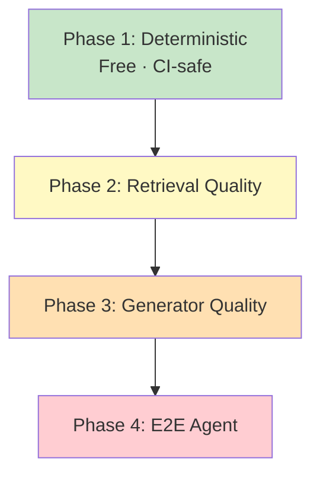

# Testing & Evaluation Guide

Project Kisan uses a **4-phase testing strategy** that moves from fast, free, deterministic tests to progressively more expensive LLM-based evaluations:

1. **Phase 1 — Deterministic**: Unit and integration tests with no external services. Free, fast, CI-safe.
2. **Phase 2 — Retrieval Quality**: Measures retriever accuracy against a gold-standard dataset. Requires [Qdrant](https://qdrant.tech/) + [OpenAI](https://platform.openai.com/) key.
3. **Phase 3 — Generator Quality**: LLM-as-judge evaluation of RAG answer quality via [DeepEval](https://docs.confident-ai.com/). Requires [Qdrant](https://qdrant.tech/) + [OpenAI](https://platform.openai.com/) key.
4. **Phase 4 — End-to-End Agent**: Full conversation traces through the orchestrator with tool call verification. Requires [Qdrant](https://qdrant.tech/) + [OpenAI](https://platform.openai.com/) key.

## Test Architecture



## Summary

| Phase | Directory | Key Files | Services Needed |
|-------|-----------|-----------|-----------------|
| 1 — Deterministic | `tests/unit/`, `tests/integration/` | 9 unit + 2 integration files | None |
| 2 — Retrieval Quality | `tests/evaluation/` | `test_scheme_retrieval.py` | Qdrant, OpenAI |
| 3 — Generator Quality | `tests/evaluation/` | `test_scheme_generation.py` | Qdrant, OpenAI |
| 4 — E2E Agent | `tests/evaluation/` | `test_agent_e2e.py` | Qdrant, OpenAI |

## Prerequisites

- [Python 3.11+](https://www.python.org/downloads/)
- [uv](https://docs.astral.sh/uv/getting-started/installation/) package manager (`curl -LsSf https://astral.sh/uv/install.sh | sh`)
- [Docker](https://docs.docker.com/get-started/get-docker/) (for running Qdrant locally — Phases 2–4)
- [OpenAI API key](https://platform.openai.com/api-keys) (Phases 2–4 only)

**Phase 1 only (no external services):**

```bash
uv sync --extra dev
```

**Phases 2–4 (requires [Qdrant](https://qdrant.tech/) + [OpenAI](https://platform.openai.com/)):**

```bash
uv sync --extra dev --extra eval

# Start Qdrant and index scheme documents
docker run -d -p 6333:6333 qdrant/qdrant
uv run python scripts/index_schemes.py

# Set OpenAI API key
export OPENAI_API_KEY="sk-..."
```

---

## Phase 1: Deterministic Tests

### Unit Tests

| Test File | What It Covers |
|-----------|---------------|
| `test_tool_selection.py` | Tool definition structure, dispatch routing, error wrapping |
| `test_mandi_entity_extraction.py` | Mandi argument handling, output formatting, edge cases |
| `test_disease_parsing.py` | Parsing mock [GPT-4o](https://platform.openai.com/docs/models) responses into `DiseaseDetectionResult` |
| `test_schemas.py` | [Pydantic](https://docs.pydantic.dev/) schema validation across all subsystems |
| `test_config.py` | Settings defaults, env overrides, caching |
| `test_pdf.py` | PDF-to-chunk pipeline (sections, tables, scheme names, content types, hierarchy) |
| `test_session.py` | Session CRUD, message trimming, LLM message formatting |
| `test_mandi_repository.py` | Mandi price repository (upsert, filter, freshness, cleanup) |
| `test_mandi_scheduler.py` | Mandi price fetch scheduler (start/stop, retries, cleanup) |

### Integration Tests

| Test File | What It Covers |
|-----------|---------------|
| `test_api.py` | FastAPI endpoint testing via TestClient |
| `test_mandi_cache.py` | Mandi price caching integration |

### Run Phase 1

```bash
# All unit tests
uv run pytest tests/unit/ -v

# All integration tests
uv run pytest tests/integration/ -v

# Specific file
uv run pytest tests/unit/test_disease_parsing.py -v

# With coverage
uv run pytest tests/unit/ --cov=kisan --cov-report=html
```

<details>
<summary><strong>Why 37 tests for disease parsing?</strong></summary>

Disease parsing is safety-critical — incorrect parsing of pesticide names, dosages, or severity could harm crops or farmers. The 37 tests cover: valid full responses, partial responses, missing fields, malformed JSON, edge cases in severity mapping, multi-disease detection, and various GPT-4o output formats. This density is intentional.

</details>

---

## Phase 2: Retrieval Quality

Measures how well the scheme RAG retriever finds the right documents.

### Metrics

| Test Class | Metric | Threshold |
|-----------|--------|-----------|
| `TestSchemeRetrievalQuality::test_recall_at_k` | Recall@5 across all non-adversarial cases | >= 70% |
| `TestSchemeRetrievalQuality::test_mrr` | Mean Reciprocal Rank | >= 0.6 |
| `TestSchemeRetrievalQuality::test_context_precision` | Fraction of retrieved docs that are relevant | >= 40% |
| `TestSchemeRetrievalByCategory::test_factual_queries_recall` | Recall@5 for factual-only queries | >= 80% |
| `TestSchemeRetrievalByCategory::test_cross_scheme_queries_recall` | Recall@5 for cross-scheme queries | >= 50% |
| `TestSchemeRetrievalByCategory::test_adversarial_returns_low_scores` | Nonexistent-scheme queries get low scores | Informational |
| `TestSchemeNameExtraction::test_scheme_names_from_query_results` | Scheme name extraction accuracy | >= 70% |
| `TestRetrievalScoreDistribution::test_relevant_results_above_threshold` | Score distribution analysis | Informational |

### Run Phase 2

```bash
uv run pytest tests/evaluation/test_scheme_retrieval.py -m eval -v -s
```

<details>
<summary><strong>Dataset details (37 cases, 5 categories)</strong></summary>

The gold-standard dataset lives at `tests/evaluation/data/scheme_retrieval.json` and contains 37 test cases:

| Category | Count | Purpose |
|----------|-------|---------|
| `factual` | 20 | Direct questions with verifiable answers from PDFs |
| `process` | 4 | How-to questions about application/payment flows |
| `eligibility` | 2 | Who qualifies for each scheme |
| `cross_scheme` | 3 | Questions spanning multiple schemes |
| `adversarial_*` | 8 | Nonexistent schemes, misleading premises, wrong amounts |

Each case has: `query`, `expected_sources`, `expected_schemes`, `category`, and `ground_truth_answer`.

</details>

<details>
<summary><strong>Why Recall@5 and MRR?</strong></summary>

Recall@5 measures whether the correct document appears anywhere in the top 5 results — critical because the generator only sees retrieved context. MRR rewards ranking the correct document higher. Together they ensure the retriever both finds and prioritizes the right content. Context Precision catches cases where the retriever returns relevant results mixed with too much noise.

</details>

---

## Phase 3: Generator Quality (DeepEval)

Uses LLM-as-judge to evaluate whether the generated answer is faithful, relevant, and non-hallucinated.

### Metrics

| Test Class | Metric | Threshold |
|-----------|--------|-----------|
| `TestSchemeGenerationQuality::test_faithfulness_above_threshold` | Average FaithfulnessMetric | >= 0.7 |
| `TestSchemeGenerationQuality::test_answer_relevancy_above_threshold` | Average AnswerRelevancyMetric | >= 0.7 |
| `TestSchemeGenerationQuality::test_hallucination_below_threshold` | Average HallucinationMetric | <= 0.3 |
| `TestSchemeGenerationByCategory::test_factual_faithfulness` | Faithfulness for factual queries | >= 0.8 |
| `TestSchemeGenerationByCategory::test_process_relevancy` | Relevancy for process queries | >= 0.7 |
| `TestSchemeGenerationByCategory::test_eligibility_relevancy` | Relevancy for eligibility queries | >= 0.7 |

### How it works

1. For each non-adversarial case in `scheme_retrieval.json`, calls `SchemeRetriever.query()` to get the live answer + retrieval context
2. Builds a DeepEval `LLMTestCase` with `input`, `actual_output`, `expected_output`, and `retrieval_context`
3. Runs three metrics (Faithfulness, Answer Relevancy, Hallucination) against each test case
4. Results are cached — queries are run once in a module-scoped fixture to avoid N x M LLM calls

### Run Phase 3

```bash
uv run pytest tests/evaluation/test_scheme_generation.py -m eval -v -s
```

---

## Phase 4: End-to-End Agent

Tests the full agent loop: user message -> orchestrator -> tool selection -> tool execution -> response generation.

### Test Classes

| Test Class | What It Verifies |
|-----------|-----------------|
| `TestSingleToolRouting::test_scheme_queries_use_search_schemes` | Scheme queries -> `search_schemes` tool |
| `TestSingleToolRouting::test_mandi_queries_use_get_mandi_prices` | Mandi queries -> `get_mandi_prices` tool |
| `TestSingleToolRouting::test_no_tool_queries_return_direct_response` | Greetings -> no tool calls |
| `TestMultiTurnConversation::test_follow_up_question_uses_context` | Multi-turn context preservation |
| `TestMultiTurnConversation::test_topic_switch_within_session` | Topic switch within session |
| `TestAgentSafety::test_off_topic_handled_gracefully` | Adversarial inputs handled safely |
| `TestAgentLatency::test_single_turn_under_10_seconds` | Latency measurement (informational) |

### Run Phase 4

```bash
uv run pytest tests/evaluation/test_agent_e2e.py -m eval -v -s
```

<details>
<summary><strong>Scenario dataset (15 scenarios, 6 categories)</strong></summary>

The dataset lives at `tests/evaluation/data/agent_scenarios.json` and contains 15 scenarios:

| Category | Count | What It Tests |
|----------|-------|--------------|
| `single_tool_scheme` | 4 | Query -> `search_schemes` -> answer |
| `single_tool_mandi` | 3 | Query -> `get_mandi_prices` -> price summary |
| `single_tool_disease` | 2 | Query with image -> `detect_disease` -> diagnosis |
| `multi_turn` | 3 | 2–3 message sequences testing context preservation |
| `no_tool` | 2 | Greetings / general questions with no tool calls |
| `adversarial` | 1 | Off-topic / injection attempts |

</details>

---

## Running All Tests

```bash
# CI-safe (Phase 1 only, no external services)
uv run pytest tests/ -m "not eval" -v

# All evaluation tests (Phases 2–4)
uv run pytest tests/evaluation/ -m eval -v -s

# Everything
uv run pytest tests/ -v

# Exclude eval
uv run pytest tests/ -m "not eval" -v
```

## CI Notes

All evaluation tests are marked with `@pytest.mark.eval` (using [pytest](https://docs.pytest.org/)). Recommended CI configuration:

```yaml
# Run deterministic tests on every push
- name: Unit & Integration Tests
  run: uv run pytest tests/ -m "not eval" -v

# Run eval tests on a schedule or manual trigger
- name: Evaluation Tests
  run: uv run pytest tests/evaluation/ -m eval -v -s
  env:
    OPENAI_API_KEY: ${{ secrets.OPENAI_API_KEY }}
```

The `eval` marker is registered in `pyproject.toml`:

```toml
[tool.pytest.ini_options]
markers = [
    "eval: marks tests as evaluation tests (deselect with '-m \"not eval\"')",
]
```

## Linting ([Ruff](https://docs.astral.sh/ruff/))

```bash
# Check
uv run ruff check src/ tests/

# Auto-fix
uv run ruff check src/ tests/ --fix

# Format
uv run ruff format src/ tests/
```

## Troubleshooting

<details>
<summary><strong>"Connection refused" on Qdrant</strong></summary>

Ensure Qdrant is running:

```bash
docker ps
curl http://localhost:6333/collections
```

If not running, start it:

```bash
docker run -d -p 6333:6333 qdrant/qdrant
```

</details>

<details>
<summary><strong>"Invalid API key" from OpenAI</strong></summary>

Verify your key is set and valid:

```bash
echo $OPENAI_API_KEY
```

Ensure it's in your `.env` file or exported in your shell.

</details>

<details>
<summary><strong>"No module named 'kisan'"</strong></summary>

If not using `uv run`, set the Python path:

```bash
export PYTHONPATH=src
```

Or prefix commands:

```bash
PYTHONPATH=src pytest tests/unit/ -v
```

Using `uv run` handles this automatically.

</details>

<details>
<summary><strong>"No price data found" for mandi queries</strong></summary>

The mandi API requires an API key from data.gov.in. Without the key, queries return empty results (not an error). [Get an API key from data.gov.in](https://data.gov.in/) and set `MANDI_API_KEY` in your `.env` file.

</details>

<details>
<summary><strong>Tests failing with import errors</strong></summary>

```bash
# Reinstall all dependencies
uv sync --extra dev --extra eval

# Verify Python version
python --version  # Must be 3.11+
```

</details>

## Manual Testing

<details>
<summary><strong>curl examples</strong></summary>

**Health check:**

```bash
curl http://localhost:8080/health
# {"status": "healthy", "service": "kisan", "version": "0.1.0"}
```

**Chat — basic message:**

```bash
curl -X POST http://localhost:8080/api/v1/chat \
  -H "Content-Type: application/json" \
  -d '{"message": "Hello, how are you?"}'
```

**Chat — government scheme query:**

```bash
curl -X POST http://localhost:8080/api/v1/chat \
  -H "Content-Type: application/json" \
  -d '{"message": "What is PM-KISAN scheme?"}'
```

**Chat — mandi price query:**

```bash
curl -X POST http://localhost:8080/api/v1/chat \
  -H "Content-Type: application/json" \
  -d '{"message": "What is the price of wheat in Delhi?"}'
```

**Chat — disease detection with image:**

```bash
IMAGE_BASE64=$(base64 -i path/to/crop_image.jpg)
curl -X POST http://localhost:8080/api/v1/chat \
  -H "Content-Type: application/json" \
  -d "{\"message\": \"What disease does this crop have?\", \"image\": \"$IMAGE_BASE64\"}"
```

**Session continuity:**

```bash
# First message — note the session_id in the response
curl -X POST http://localhost:8080/api/v1/chat \
  -H "Content-Type: application/json" \
  -d '{"message": "I grow wheat in Punjab"}'

# Follow-up with session_id
curl -X POST http://localhost:8080/api/v1/chat \
  -H "Content-Type: application/json" \
  -d '{"message": "What diseases should I watch for?", "session_id": "<session_id_from_above>"}'
```

**Get session history:**

```bash
curl http://localhost:8080/api/v1/sessions/<session_id>
```

**Delete session:**

```bash
curl -X DELETE http://localhost:8080/api/v1/sessions/<session_id>
```

</details>
